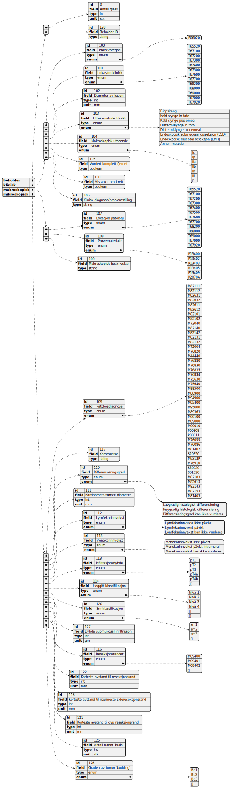

# From Free-Text to Structured Data: Extracting Medical Information with Large Language Models

master-project.wip.exe.zip.lib.rar

## Data Model
The data model is based upon the [strukturert-rekvisisjon-og-svarrapport-for-patologirapportering-0.76.xlsx](https://www.kreftregisteret.no/globalassets/tarmkreftscreening/dokumenter/kvalitetsmanualen/vedlegg/strukturert-rekvisisjon-og-svarrapport-for-patologirapportering-0.76.xlsx) spreadsheet. 
Info of the different fields can be found inside the spreadsheet as well as [Here](https://www.kreftregisteret.no/screening/tarmscreening/for-helsepersonell/kvalitetsmanual/kapittel-11-laboratorieprosedyre-for-patologitjenesten).

Since many of these required fields use predefined enum values they are being defined globally and by using "references" inside the json, the python script replaces the enum with its possible values. This allows for reuse as well as more readability.
The final generated data models can be found in the `model/out` folder. 
Resulting in data models for clinical, macroscopic and microscopic analysis reports.

The generated data models have a "value" field which is set to null. This is going to be given to the LLM along with the prose text for each reporting step (clinical, macroscopic, microscopic).

~~**One thing to keep in mind is that the LLMs have different and a limited context window sizes and max lengths. Since some of the data models contain a lot of different enum values and/or fields that are required. Strategies to midigate this might include splitting up into multiple prompts/evals. Further investigation will occur once the extraction process of real data starts.**~~
Update: After using improved test data the spitting of prompts seems necessary. Now each json entry in the model is prompted individually instead of the whole model per prompt. This increases generation times, but is necessary for the output to not get cut off which due to the relatively small max length of the used models (~512 tokens). Other models with larger context length might be used to prevent this issue, but availability of such open source models and which are pre-trained on norwegian makes it out of scope for this project.

## UML Diagram of Structured Model
Generated using [Code2Diagram.com](https://www.code2diagram.com/console):

## Data Collection Process
Data extraction will start after approval, early 2025.

## Data Labeling
The labeling program takes in a text containing either *klinisk*, *makroskopisk* or *microskopisk* information. The text is then mapped to the corresponding data model. Every field from the data model is then prompted to be labeled by the user. In addition to the clinical information the user is prompted to fill in the data model based on the glass container. Since each text can include multiple containers that needs to be mapped in a one to many relation to the corresponding data model. 

The resulting labeled data is then stored in a json with the fields:
- *input_text* | The original information text.
- *template_json* | A copy of either *klinisk*, *makro* or *micro* model for easy unlabeled dataset.
- *target_json* | The "correctly" labeled out json that the model will try to replicate. 
- *container_json* | Info about the total amount of glass containers in the original *input_text* as well as the number corresponding to the filled out *target_json*. (1-indexed)

## Training / Fine-tuning Process
The project will focus on using open source models that already have been trained to understand natural language. Since this project involves analyzing medical journal texts which contains prose written in norwegian, more specialiced trained models will be used. Namely some of the norwegian trained models by the [Language Technology Group (University of Oslo) on HuggingFace](https://huggingface.co/ltg).

These models will be fine-tuned to extract medical information from the medical prose text and fill out the `null` fields from a json formatted data model. The models result will be compared with a pre-filled correct labeled data model corresponding to the given input.
The model will then use back-propagation to adjust its weights by using a loss function.

An overview of how the dataset is structured, along with training and the evaluation process:

### Tokenization
- Added enums to tokenizer.

### Encoder 
- Masked learning
- Allowed tokens filtering
- *Single token restriction*
- Differ from NER

### Decoder
- Casual learning
- Prompt engineering; Starter tokens
- Masked attention

### Encoder-Decoder
- Sequence to Sequence

## Evaluating data
- Separate from training

## Investigate
- See if end of sentence marker impacts different models.
- Encoder: 
    * Extra label specific masked training
    * One mask to many tokens. (String comments etc)
- 

## Libraries
- pytest: Unit testing