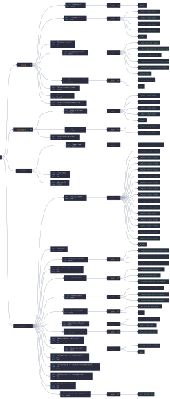

# From Free-Text to Structured Data: Extracting Medical Information with Large Language Models

## Abstract
master-project.wip.exe.zip.lib.rar

## Project Structure Overview
- **model_loader.py**: ModelLoader class for managing loading and generating output from the models.
- **model_strategy.py**: Containing model architecture specific logic for encoder, decoder and encoder-decoder models.
- **dataset_loader.py**: Loads the labeled JSON data, creates a prompt for every field in the JSON and stores it as a *HuggingFace Dataset*. Also finds all the unique enum definitions in the dataset which will be added as separate tokens.
- **model_train.py**: Training script that adds enum definitions as new tokens and trains/fine-tunes the models based on their architecture.
- **server.py**: Simple Flask API for using the models with POST requests. Request paths for "/load_model" and "/generate".
- **tests/**: Folder containing *pytest* unit tests
<details>
<summary><b>data/</b>: Dataset labeling</summary>

* **batch/**: The full unlabeled text data real world pathology reports. ***##WIP##***
* **labeled_data/**: The fully labeled data from *batch* in separated JSON form. ***##WIP##***
* **example_batch/**: Small sample of pathology reports (missing 'klinisk' info).
* **test_data/**: The labeled test data from *example_batch*, used for initial development.
* **label_data.py** Simple data labeling program that takes user input and generates training data.
</details>

<details>
<summary><b>data_model/</b>: Data Model creation based on the <a href="#data-model">pathology spreadsheet</a></summary>

* **generate_data_model.py**: Fill in each model *struct* where every entry gets a *null* "value" field and enum definitions are filled in using the enum.
* **struct/**: Containing all the base field for every report type and metadata with reference strings to enums such as *"REF_ENUM;Lokasjon"*.
* **enum/**: Contains all enum definitions.
* **figure/**: Combining the full data model and representing it as a more readable svg figure.
* **out/**: Output directory of the filled model *struct*
</details>

<details>
<summary><b>utils/</b>: Decoupled configurations, definitions and help functions.</summary>

- **config.py**: Constant definitions, including the definition of the used HuggingFace models. *Change the MODELS_DICT if you want to train a different HuggingFace model.*
- **enums.py**: Containing enum definitions mappings for model and report type.
- **token_constraints.py**: Generation constraints for stopping auto regressive models and finding allowed unmask tokens for the encoder model.
- **file_loader.py**: Helping functions for handling JSON and text files.
</details>

### Libraries
- LLM:
    1. [*torch (cuda)*](https://pytorch.org/get-started/locally/)
    2. [*Transformers*](https://pypi.org/project/transformers/)
    3. [*datasets*](https://pypi.org/project/datasets/)
    4. [*accelerate*](https://pypi.org/project/accelerate/)
    5. [*peft*](https://pypi.org/project/peft/)
- Testing
    1. [*pytest* for unit testing](https://pypi.org/project/pytest/)
- REST API
    - [*Flask*](https://pypi.org/project/Flask/)

### Installation:
1. [Install torch](https://pytorch.org/get-started/locally/), preferably CUDA for GPU support.
2. `pip install -r requirements.txt` for rest of dependencies

## Structured Data Model
The data model is based upon the [strukturert-rekvisisjon-og-svarrapport-for-patologirapportering-0.76.xlsx](https://www.kreftregisteret.no/globalassets/tarmkreftscreening/dokumenter/kvalitetsmanualen/vedlegg/strukturert-rekvisisjon-og-svarrapport-for-patologirapportering-0.76.xlsx) spreadsheet. 
Info of the different fields can be found inside the spreadsheet as well as [Here](https://www.kreftregisteret.no/screening/tarmscreening/for-helsepersonell/kvalitetsmanual/kapittel-11-laboratorieprosedyre-for-patologitjenesten).

Since many of these required fields use predefined enum values they are being defined globally and by using "references" inside the JSON, the python script replaces the enum with its possible values. This allows for reuse as well as more readability.
The final generated data models can be found in the `model/out` folder. 
Resulting in data models for clinical, macroscopic and microscopic analysis reports.

The generated data models have a "value" field which is set to null. This is going to be given to the LLM along with the prose text for each reporting step (clinical, macroscopic, microscopic).

## UML Diagram of Structured Model
The figure is generated using [omute.net](https://omute.net/editor) [[git]](https://github.com/AykutSarac/jsoncrack.com).
This is a simplified figure where some enum values are grouped and "id" and "value": null is removed for readability.


## Data Collection Process
Data extraction will start after approval, early 2025.


## Data Labeling
The labeling program takes in a prose text containing either *klinisk*, *makroskopisk* or *microskopisk* text.
The text content determines which of the data model for the different report types should be used.
The text is then mapped to the corresponding data model, in a one to many relationship. 
As seen in the example text below, a single report can contain multiple glass samples with different attributes, hence requiring a multiplicity relationship:
```js
//`data/example_batch/case_1_makro.txt`:
3 glass, merket 1 - 3
 1: 4  gryn i #1
 2: 3  gryn i #2
 3: 7  gryn i #3
```
Every field for the respective data model type is then prompted to be filled out by the user based on the glass number.
The metadata contains the report type, the total glass number in the text and the glass number of which is currently being filled out.

The resulting labeled data is then stored in a JSON with the fields:
- *input_text* | The original information text.
- *target_json* | The "correctly" labeled out JSON that the model will try to replicate. 
- *metadata_json* | The report type, total amount of glass containers in the original *input_text* as well as the number corresponding to the filled out *target_json*. (1-indexed)


## Dataset Creation
One thing to keep in mind is that the LLMs used have a limited context window sizes and max lengths. 
Since some of the data models, namely the microscopic data model contain a lot of different enum values.
Strategies to mitigate this include removing non-critical fields such as "is_required" from the model and splitting up each prompts into multiple.
Other models with larger context length might be used to prevent this issue, but with higher resource usage since attention generally scales quadratically with sequence length.
Furthermore, the availability of such open source models and which are pre-trained on norwegian makes it out of scope for this project.

After using improved test data the spitting of prompts seems necessary. 
Now each JSON entry in the model is prompted individually instead of the whole model template per prompt.
This increases initial dataset creation complexity, but allows for more flexibility and allows for injecting and requesting specific fields.
This feature was later used to inject metadata info into the training data for allowing to extract things like report type and total glass containers.


## Training / Fine-tuning Process
The project will focus on using open source models that already have been trained to understand natural language. Since this project involves analyzing medical journal texts which contains prose written in norwegian, more specialized trained models will be used. Namely some of the norwegian trained models by the [Language Technology Group (University of Oslo) on HuggingFace](https://huggingface.co/ltg).

These models will be fine-tuned to extract medical information from the medical prose text and fill out the `null` fields from a JSON formatted data model. 
The models result will be compared with a pre-filled correct labeled data model corresponding to the given input.
The model will then use back-propagation to adjust its weights by using the calculated loss.

An overview of how the dataset is structured, along with training and the evaluation process:


### Tokenization
Just before the training/fine-tuning process begins, new tokens from the dataset are added to the tokenizer.
The added tokens are enum values that can be used by the model to fill out the JSON.
By making each enum a single word token it makes it possible for the encoder model to unmask the value without having the token being split up into multiple tokens.
It also simplifies the process of allowing certain tokens as the `enum` field that specifies which values are allowed in the `value` field since each token will have a single dedicated id.
The model's embeddings (and classifier manual fix for ltg encoder/encoder-decoder) are resized to fit the new tokens.

### Restricted tokens
By reducing the possible allowed tokens the model can produce, the chances that an invalid token is generated is reduced.
This is done by setting the score values for the non allowed tokens to -inf, when unmasking for encoder models and by using a `LogitsProcessor` for autoregressive models (encoder-decoder & decoder). 
This `LogitsProcessor` triggers when the `value` field, a `:` and a `"` is generated.
The constrainted `LogitsProcessor` also force closes the `"` and generates a `}` which will stop the generation due to the `StoppingCriteria`. (See `token_constraints.py` for full implementation)

### Encoder 
- Masked learning
- Differ from NER
- Limitation: *Single token restriction*

### Decoder
- Casual learning
- Prompt engineering; Starter tokens
- Masked attention

### Encoder-Decoder
- Sequence to Sequence
- Only output a single JSON field to save tokens.

## Evaluation of Models
- Separate from training
- TODO: Evaluation metrics presented as graphical, tables etc.

## Investigate
- Encoder: 
    * Extra label specific masked training
    * One mask to many tokens. (String comments etc)
- Create simple frontend UI to illustrate the use of the server.py API and to implement labeling correction (feedback loop).